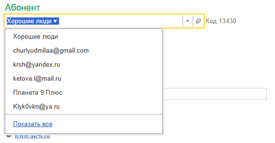
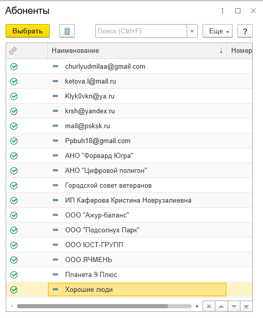
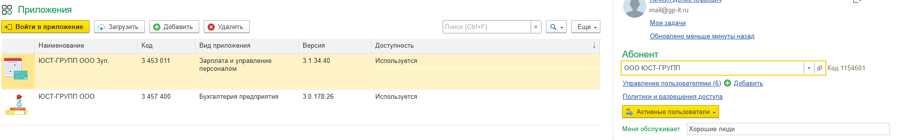
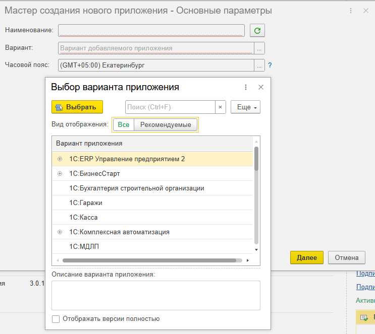

В этой статье рассказано, как можно добавить базу клиенту.

1. Войти в свой личный кабинет, например, щелкнув ссылку {width=24px height=24px} **Личный кабинет** на странице **Мои приложения** сайта сервиса.

   {width=756px height=227px}

2. После открытия Менеджера Сервиса, найдите нашего абонента «**Хорошие люди**» и нажмите стрелочку рядом с наименованием, выпадет список абонентов и нажмите «**Показать все**».

   {width=568px height=296px}

3. Выберите из списка нужного абонента (клиента), нажмите на него и нажмите кнопку «**Выбрать**».

   {width=513px height=620px}

4. У вас поменяется список баз и наименование абонента - только что, вы зашли на ФРЭШ нашего клиента. Учтите, что добавлять базы может только пользователь с правами «**Владелец абонента**».

   {width=1830px height=285px}

5. Нажмите кнопку с зелёным плюсиком «**Добавить**», выйдет окно создания нового приложения. Во второй строчке «**Вариант**» нажмите на три точки, выпадет окно выбора приложений.

   {width=743px height=663px}

6. Выберите то приложение, которое нужно клиенту (Бухгалтерия предприятия, ЗУП, УНФ и тд.). Нажмите кнопку «**Далее**».

7. Назначьте права для нужных пользователей («**Запуск**», «**Запуск и администрирование**», «**Нет доступа**»). Нажмите кнопку «**Далее**».

8. После чего мастер создания сообщит, что база готовится и скоро будет готова к запуску.