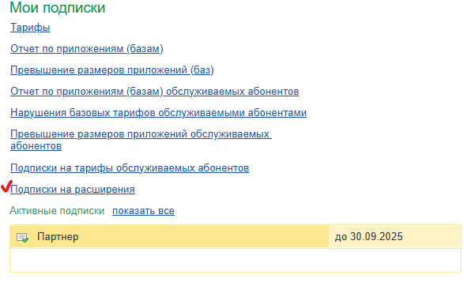
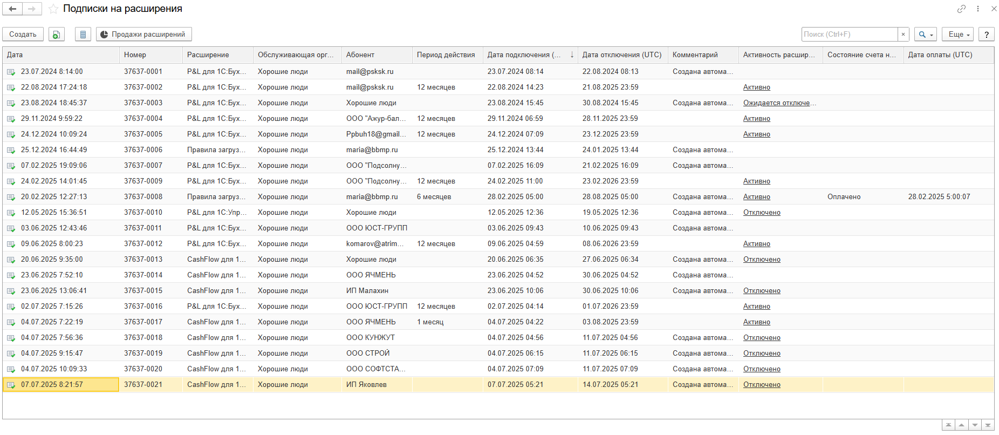
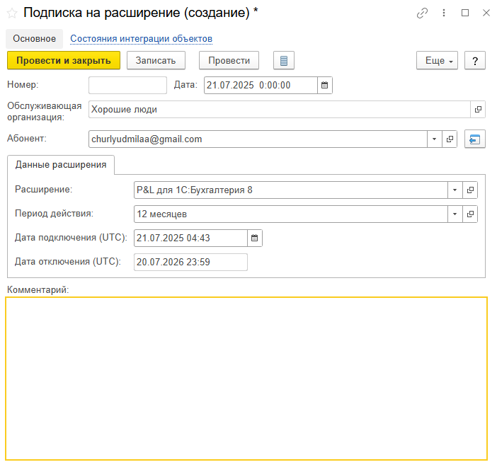

В этой статье рассказано, как оператор или владелец обслуживающей организации могут оформить подписку на P&L для клиента на 1С:ФРЭШ.

1. Войти в свой личный кабинет, например, щелкнув ссылку {width=24px height=24px} **Личный кабинет** на странице **Мои приложения** сайта сервиса.

   {width=756px height=227px}

2. После открытия Менеджера Сервиса, посмотрите в правый нижний угол и нажмите на ссылку «**Подписки на расширения**».

   {width=587px height=362px}

3. Выйдет таблица со всеми активными подписками на расширения обслуживаемых абонентов. Для подключения подписки на P&L нажмите кнопку «**Создать**».

   {width=1852px height=806px}

4. Вам откроется формочка создания подписки на расширение тарифа. В ней вам необходимо выбрать нужного **абонента (клиента)**,  выбрать само **расширение P&L** из выпадающего списка и **период действия** (1 месяц, 6 месяцев, 12 месяцев).

   {width=702px height=660px}

5. Далее нажмите кнопку «**Провести и закрыть**». Подписка оформлена.