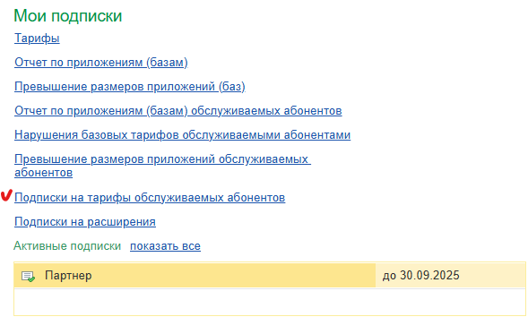
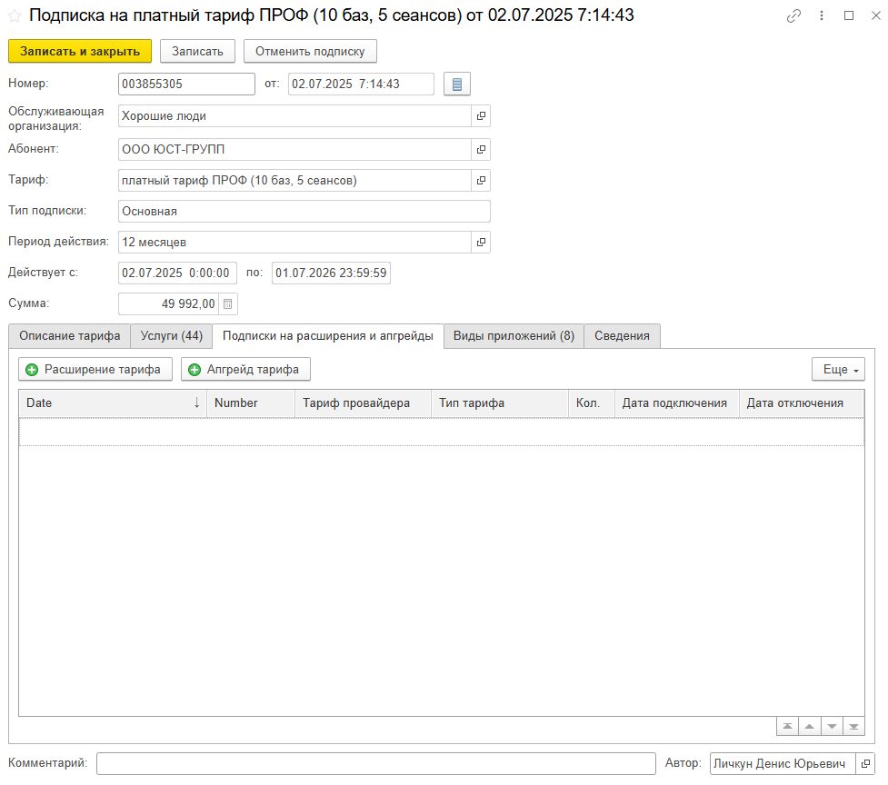
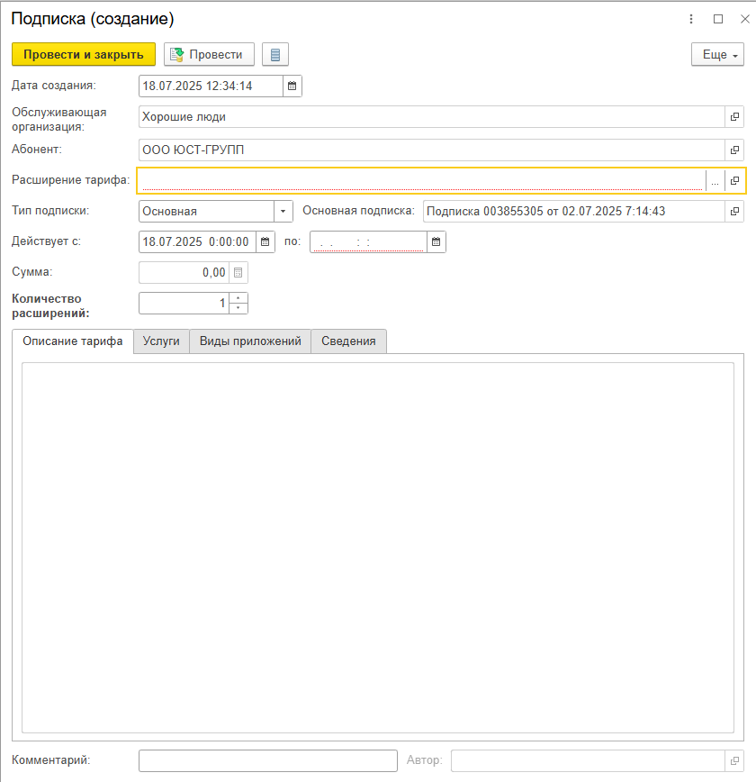
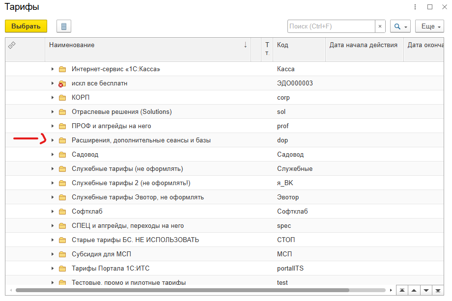
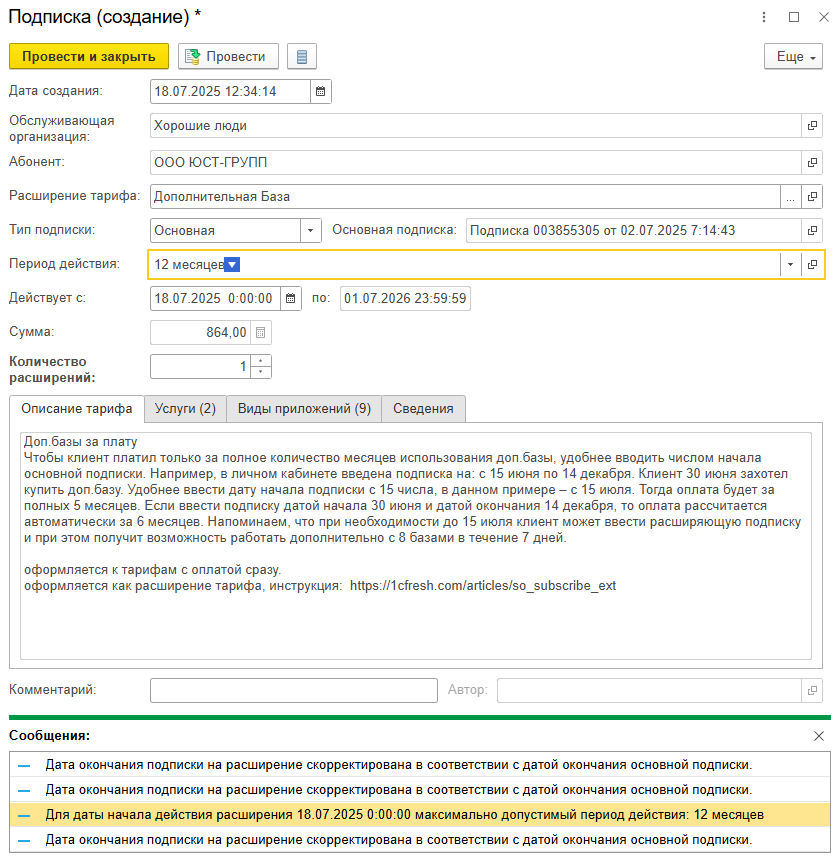

В этой статье рассказано, как оператор или владелец обслуживающей организации могут оформить доп. базы или доп. сеансы для клиента на 1С:ФРЭШ.

1. Войти в свой личный кабинет, например, щелкнув ссылку {width=24px height=24px} **Личный кабинет** на странице **Мои приложения** сайта сервиса.

   {width=756px height=227px}

2. После открытия Менеджера Сервиса, посмотрите в правый нижний угол и нажмите на ссылку «**Подписки на тарифы обслуживаемых абонентов**».

   {width=589px height=373px}

3. Выйдет таблица со всеми активными подписками обслуживаемых абонентов. Для добавления доп. баз или доп. сеансов найдите **основную активную подписку клиента (обычно это «Платный тариф ПРОФ» или «Базовый»).** Перейдите в подписку двойным щелчком левой мыши. Далее в форме самой подписки найдите вкладку «**Подписки на расширения и апгрейды**» и перейдите в неё.

   {width=977px height=864px}

4. Нажмите на кнопку «Расширение тарифа». Вам откроется формочка создания подписки на расширение тарифа.

   {width=840px height=868px}

5. Нажмите на три точки, пролистайте колёсиком мыши вниз и найдите папку «**Расширения, дополнительные сеансы и базы**», раскройте её.

   {width=920px height=613px}

6. Вам необходимо выбрать двойным щелчком левой кнопки мыши, тариф с зелёной галочкой - либо «**Дополнительная База**» либо «**Дополнительный сеанс**», в зависимости от того, что потребовал клиент.

   [image:./podklyuchenie-dop-baz-ili-dop-seansov-klientu-6.png:::0,0,100,54.47154471544715:::914px:615px]

7. Далее выберите **период действия и количество расширений (кол-во баз или сеансов).** *Примечание*:  Обычно оформляется на 12 месяцев, **НО** может оказаться так, что основной тариф клиента уже проработал N-ый период времени, поэтому если вы нажмёте 12 месяцев, то сам ФРЭШ вам может скорректировать период, выведя такое сообщение «**Дата окончания подписки на расширение скорректирована в соответствии с датой окончания основной подписки.**»

   {width=838px height=863px}

8. Нажмите на «**Провести и закрыть**», подтвердите подписку, а затем «**Записать и закрыть**».

9. Поздравляю, вы оформили доп. базу или доп. сеанс для клиент на 1С:ФРЭШ.