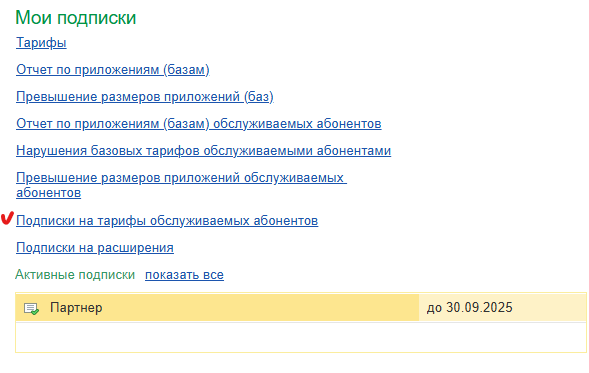
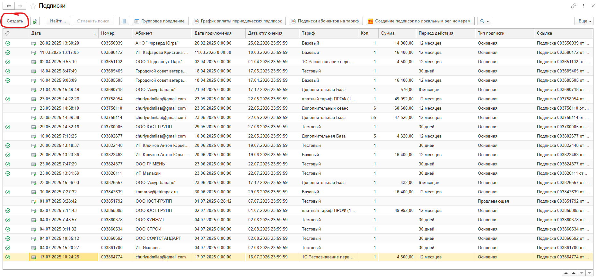
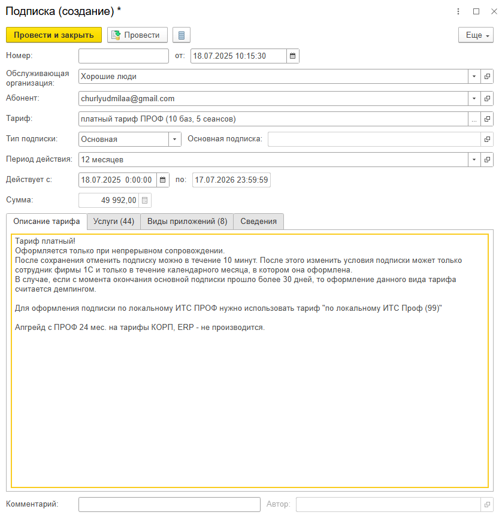

В этой статье рассказано, как оператор или владелец обслуживающей организации могут оформить тарифы для клиента на 1С:ФРЭШ.

1. Войти в свой личный кабинет, например, щелкнув ссылку {width=24px height=24px} **Личный кабинет** на странице **Мои приложения** сайта сервиса.

   {width=756px height=227px}

2. После открытия Менеджера Сервиса, посмотрите в правый нижний угол и нажмите на ссылку «**Подписки на тарифы обслуживаемых абонентов**».

   {width=589px height=373px}

3. Выйдет таблица со всеми активными подписками обслуживаемых абонентов. Для создания новой подписки на определённый тариф нажмите кнопку «**Создать**».

   {width=1859px height=864px}

4. Выскочит форма оформления подписки, на ней выберите нужного **абонента**, **тариф** и **период действия** подписки. После заполнения всех полей вам будет написана цена. 

   {width=838px height=865px}

5. Нажмите на кнопку «**Провести и закрыть**», вам выскочит предупреждение о том, что вы оформляете подписку (сделано для проверки всей информации). Нажмите галочку и подтвердите создание подписки.

6. **ВАЖНО - ЕСЛИ ВЫ ОШИБЛИСЬ, ТО У ВАС ЕСТЬ 15 МИНУТ, ЧТОБЫ НАЖАТЬ КНОПКУ «Отменить подписку», иначе через данный период подписка полностью активируется.**

