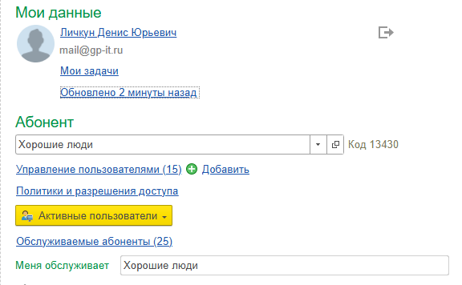
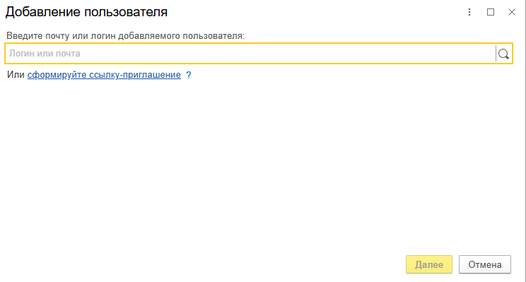
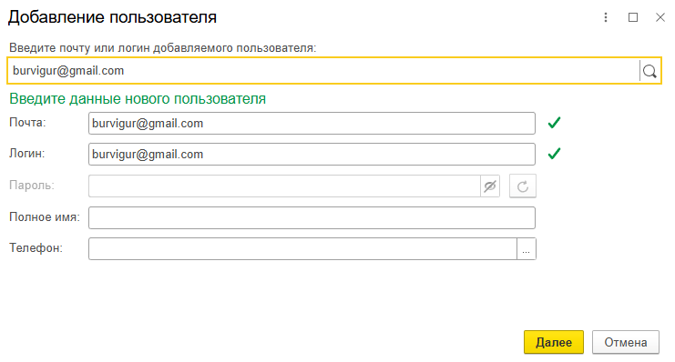
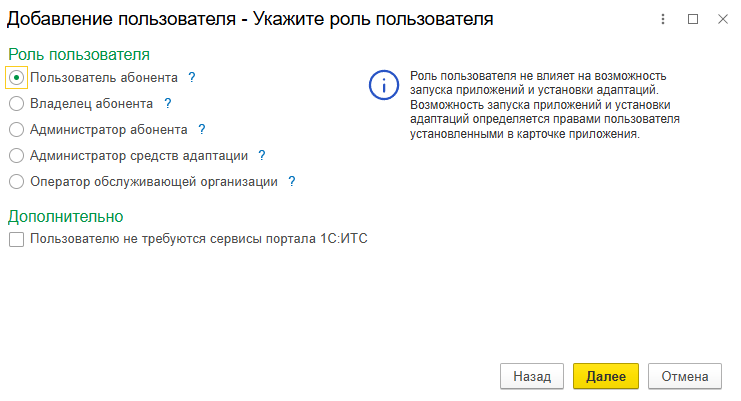

В этой статье рассказано, как можно добавить пользователя к существующей базе в 1С:ФРЭШ.

1. Войти в свой личный кабинет, например, щелкнув ссылку {width=24px height=24px} **Личный кабинет** на странице **Мои приложения** сайта сервиса.

   {width=756px height=227px}

2. Добавление происходит в любом абоненте, но добавлять может только пользователь с правами «**Владелец абонента**» или «**Администратор**». Для этого в окне Менеджера сервиса в области управления пользовател**ями нажмите кнопку «Добавить».**

   {width=576px height=356px}

3. В открывшемся окне добавления пользователя вам необходимо ввести либо **логин (если пользователь уже есть на ФРЭШе),** либо **электронную почту** для создания нового пользователя и нажать на лупу.

   {width=744px height=399px}

4. Если пользователя нет, то выскочит данное окно - система автоматически подставит **почту** и **логин,** вам же необходимо ввести **полное имя пользователя** и его **номер мобильного телефона.**

   {width=741px height=398px}

5. Далее выберите роль пользователя «**Пользователь абонента**» и нажмите «**Далее**».

   {width=741px height=401px}

6. Далее назначьте права на нужные базы («**Запуск**», «**Запуск и администрирование**», «**Нет доступа**»). Нажмите кнопку «**Далее**».