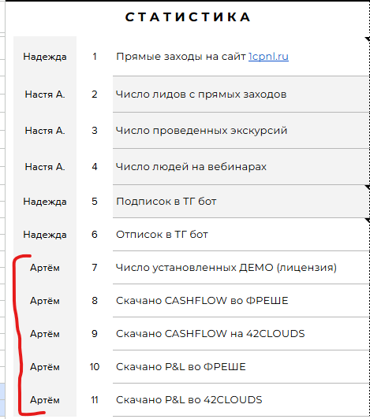
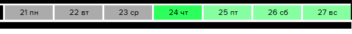
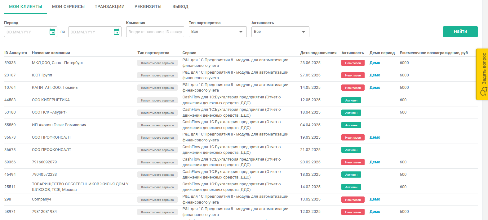
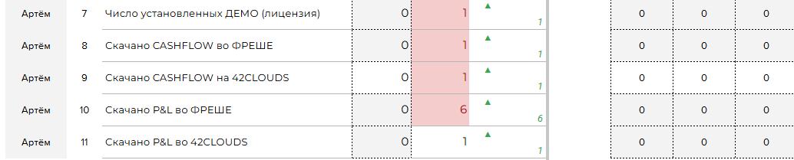
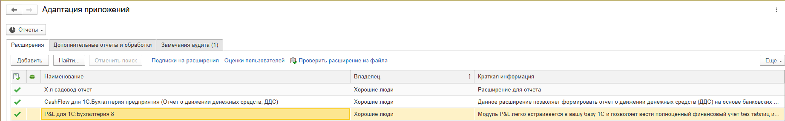
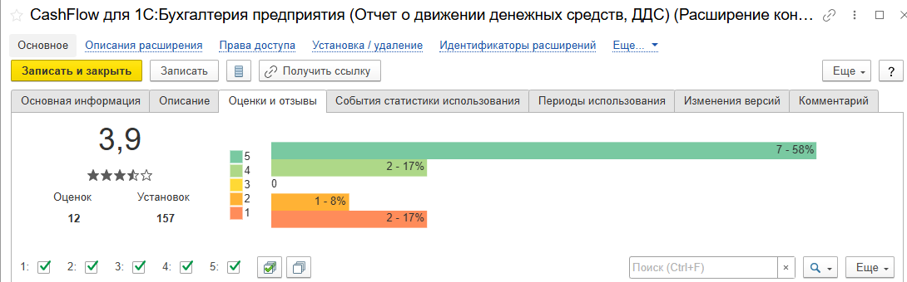

В этой статье рассказано как получить статистику скачиваний P&L и CashFlow на 1С:ФРЭШ и 42Clouds.

1. Для начала зайдите в таблицу РНП P&L (<https://docs.google.com/spreadsheets/d/1Sr9YNgayrz2EE8H8tbNd-kVfbUTBXCeBqxbZ2RArQDQ/edit?pli=1&gid=169736866#gid=169736866>). В ней найдите блок «**Статистика**», вам необходимы следующие строчки:

   {width=469px height=532px}

2. Далее вам необходимо найти конкретный день (**столбец**), за который нужно заполнить статистику.

   {width=574px height=57px}

3. Получение статистики по **42Clouds**: зайдите по данной ссылке - <https://cp.42clouds.com/partners>.

4. Слева найдите «**Партнёрам и разработчикам**»

   {width=253px height=941px}

5. Здесь можно найти подробную статистику по установкам **CashFlow и P&L** (есть дата, название клиента и какой продукт).

   {width=1574px height=711px}

6. В табличку РНП соотнесите информацию со строчками и датой и заполните клетки (0 - если ничего не было, 1 - если одно скачивание и т.д.).

   {width=1034px height=209px}

7. Получение статистики на **1С:ФРЭШ:** зайдите по ссылке <https://1cfresh.com/a/adm/ru/>. Учётные данные можете найти в других статьях.

8. Откройте «**Адаптация**» и «**CashFlow для 1С:Бухгалтерия предприятия (Отчет о движении денежных средств, ДДС)**».

   {width=1843px height=287px}

9. Найдите «**Оценки и отзывы**». Здесь вы увидите количество установок за весь период (к сожалению, по конкретным датам статистики нет).

   {width=1090px height=340px}

10. Такие же действия сделайте для «**P&L для 1С:Бухгалтерия 8**».

11. Поздравляю, вы собрали статистику!