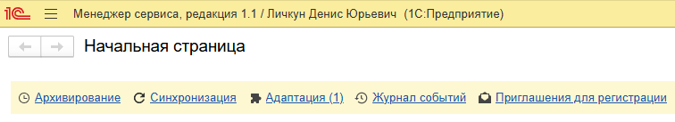
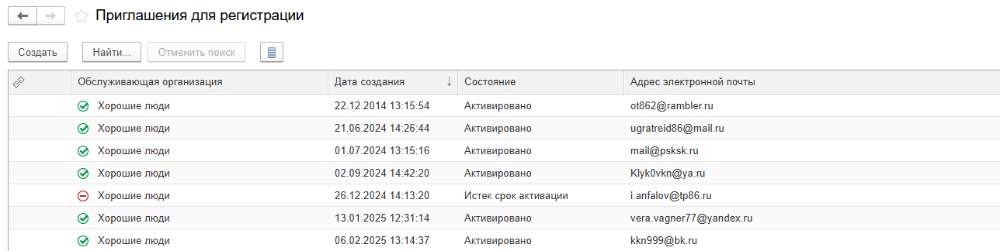
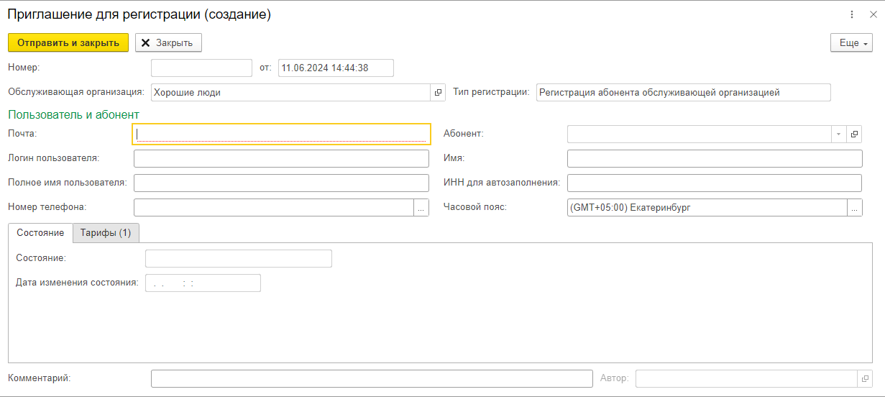
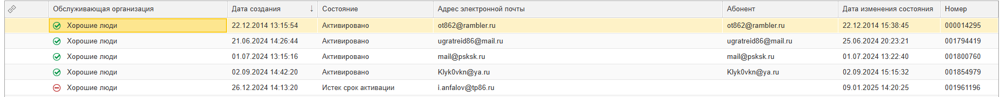
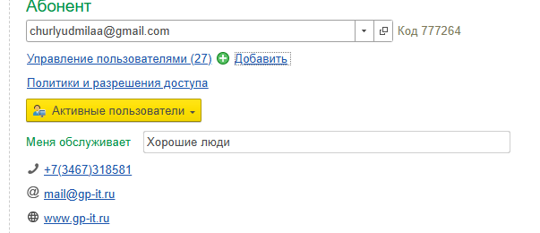
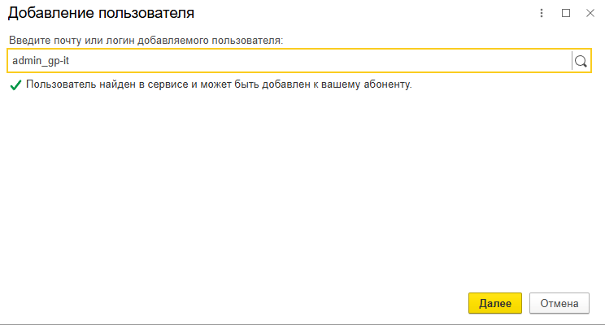
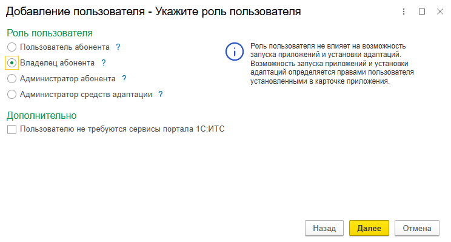

В этой статье рассказано, как оператор или владелец обслуживающей организации могут отправить приглашение в сервис новому пользователю (этот пользователь станет владельцем нового абонента сервиса).

**Как выдать приглашение**

Для выдачи приглашения оператор или владелец обслуживающей организации должен выполнить следующие действия.

1. Войти в свой личный кабинет, например, щелкнув ссылку {width=24px height=24px} **Личный кабинет** на странице **Мои приложения** сайта сервиса.

   {width=756px height=227px}

2. Нажать ссылку **Приглашения для регистрации**.

   {width=756px height=137px}

3. Будет выведена форма **Приглашения для регистрации**. В ней можно просмотреть выданные ранее коды приглашений, даты их активации и создать новый код приглашения.

4. Следует нажать кнопку **Создать** над таблицей приглашений.

   {width=1288px height=324px}

5. Будет открыто окно **Приглашение для регистрации (создание)**:

   {width=1231px height=552px}

6. Далее узнайте у клиента основные данные: **адрес электронной почты, ФИО, номер телефона, название организации и ИНН.** Вставьте эти данные в нужные поля и нажмите **«Отправить и закрыть».** Приглашение для регистрации отправится на электронную почту клиента и ему нужно будет принять его.

7. Чтобы узнать, принял ли клиент приглашение, можно посмотреть на цветной значок рядом с приглашением. **Красный** - истёк срок активации, **зелёный** - приглашение активировано, **синий** - приглашение ещё не активировано.

   {width=1850px height=181px}

8. После успешной активации, **ОБЯЗАТЕЛЬНО** запросите у клиента логин и пароль от его учетки на ФРЭШе. Это необходимо для того, чтобы добавить нашего пользователя к абоненту клиента (*для удобства доступа к базам клиента*).

9. Когда вы зашли под учёткой клиента на ФРЭШ, в **Менеджере Сервиса**, вам необходимо найти «**Управление пользователями**» и нажать на кнопку «**Добавить**».

   {width=603px height=260px}

10. В окне добавления пользователя введите данный логин «**admin_gp-it**» и нажмите на кнопку лупы. Вам должно выйти сообщение об успешном найденном пользователе.

    {width=744px height=400px}

11. Далее выберите роль пользователя «**Владелец абонента**» и нажмите «**Далее**».

    {width=744px height=399px}

