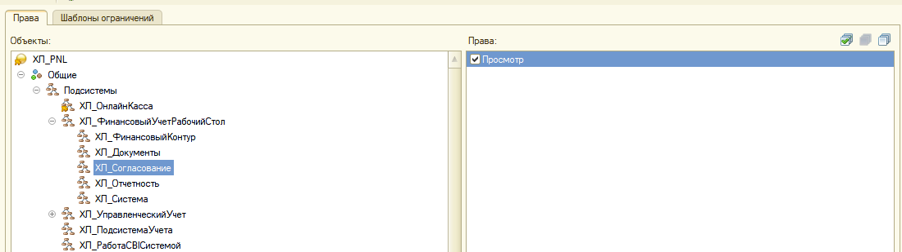

1\. Сравнить, объединить с расширением P&L по БП. **Снять галочки** со следующих объектов:

-  Подсистемы - ХЛ\_ИнтеграцияСТелеграмм

-  Роли - ХЛ\_Согласование и ХЛ\_СогласованиеБазовыеПрава

-  Подписки на событие - ХЛ\_ПриЗаписиСправочникаПользователейTelegram

-  Регламентные задания - ХЛ\_ОтправкаСообщенийПользователямТелеграм

-  Определяемые типы - ВладелецПрисоединенныхФайлов и ВладелецФайлов

-  HTTP-сервисы - все сервисы

-  Справочники - ХЛ\_НастройкиСогласования

-  Документы - ХЛ\_СогласованиеСчетов

-  Перечисления - ХЛ\_СтатусСогласования

-  В регистре сведений ХЛ\_ИсторияСогласованияСчетов с реквизитов «ДокументСогласования» и «СтатусСогласования»

-  В регистре сведений ХЛ\_ПлатежныйКалендарь с реквизита «Источник» (уточнить у разработчиков, были ли доработки по этому реквизиту, если были - внести вручную)

-  В регистре сведений ХЛ\_Согласование с реквизита «СтатусСогласования»

-  В регистре сведений	ХЛ\_СтатусыСогласованияОбъектов с реквизита «СтатусСогласования»

2\. Зайти на форму документа ХЛ\_РеестрПлатеже, в реквизите формы «Объект», в таблице «Реестр», для реквизита «СтатусСогласования» расширить тип, а именно сделать его составным и назначить дополнительно Перечисление ХЛ\_СтатусСогласования.

3\. Зашифровать общие модули ХЛ\_СистемаУчета и ХЛ\_КодДляОтчетовДДСиБДР.

4\. Зашифровать модули объекта отчетов ХЛ\_ОтчетБюджетДоходовИРасходов, ХЛ\_ОтчетДвижениеДенежныхСредств и ХЛ\_ОтчетПлатежныйКалендарь.

**Инструкция к шифрованию**:

Откройте данный сайт - <https://netlenka.org/> (логин - [birukovfa@gp-it.ru](///mailto:birukovfa@gp-it.ru), пароль - [birukovfa@gp-it.ru](///mailto:birukovfa@gp-it.ru)).

Нажмите на кнопку «**Приступить к защите**» -> в нашем модуле объекта Ctrl+A, Ctrl+C -> Ctrl+V в окно на сайте -> **Защитить**.

Скопируйте весь обфусцированный код с полной заменой обычного кода в конфигурации. Готово.

5\. Проверить права:

-  Для ролей ХЛ\_Согласование и ХЛ\_СогласованиеБазовыеПрава указать право «Просмотр» для подсистем «ХЛ\_ФинансовыйУчетРабочийСтол» и «ХЛ\_Согласование» 

{width=1100px height=309px}

-  Для ролей ХЛ\_Согласование и ХЛ\_СогласованиеБазовыеПрава указать право «Просмотр» для команды «ХЛ\_ОткрытьФормуСогласования»

[image:./ustanovka-p-l-inzhir.png:::0,0,100,100:100::1102px:455px:center]

6\. **Сделать копию базы!**

7\. Обновить конфигурацию

8\. Войти в программу и проверить, чтобы все вкладки системы открывались без ошибок. Сформировать отчеты ДДС, ОПиУ и Баланс чтобы тоже сформировались без ошибок.