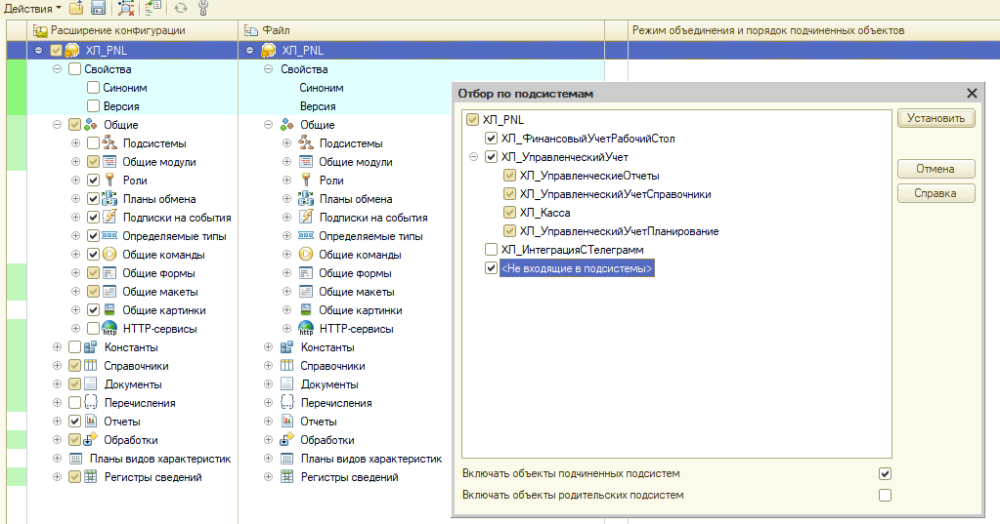
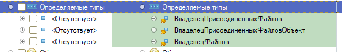
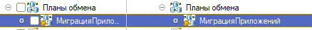
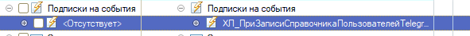
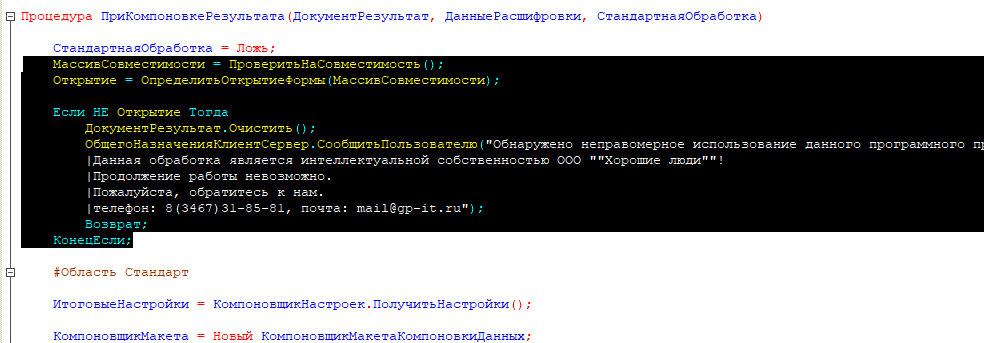
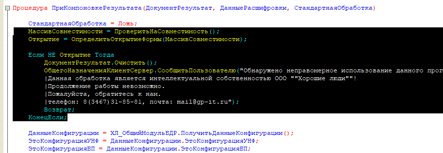
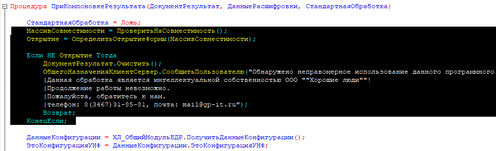
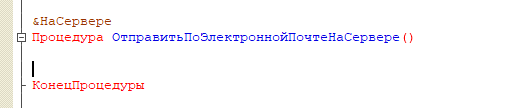
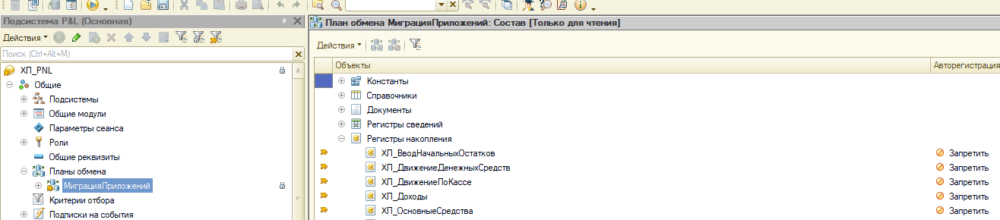

## Сравнение/объединение.

1. Отмечаем по подсистемам файла. Выбираем все кроме телеграмм

   {width=1023px height=537px}

2. Убираем галочки:

   1. Обработка ХЛ\_Баланс

   2. Документ ХЛ\_Бюджет

   3. Документ ХЛ\_БюджетМесячный

   4. Документ ХЛ\_ОтчетБаланс

   5. Общие команды ХЛ\_КраснаяКнопка

   6. Общий модуль ХЛ\_ВПФ\_Word\_ГенераторПФ

   7. План обмена Миграции данных

3. Убираем галки со всех макет, начинаются с “ХЛ\_Страница….”

   {width=591px height=214px}

4. Убираем все галочки с определяемых типов

   {width=561px height=86px}

5. Убираем галочки с планы обменов

   {width=438px height=43px}

6. Убираем галочку подписки на события

   {width=591px height=46px}

## Удаление кода

1. Общий модуль ХЛ\_КодДляОтчетовДДСиБДР - необходимо удалить пароль

2. ХЛ\_ОтчетБюджетДоходовИРасходов - необходимо удалить пароль

3. ХЛ\_ОтчетБюджетДоходовИРасходов - удалить код ПриКомпоновкеРезультата проверки ИНН

   {width=984px height=343px}

4. ХЛ\_ОтчетДвижениеДенежныхСредств - необходимо удалить пароль

5. ХЛ\_ОтчетДвижениеДенежныхСредств - удалить код ПриКомпоновкеРезультата проверки ИНН

   {width=906px height=313px}

6. ХЛ\_ОтчетПлатежныйКалендарь - необходимо удалить пароль

7. ХЛ\_ОтчетДвижениеДенежныхСредств - удалить код ПриКомпоновкеРезультата проверки ИНН

   {width=967px height=295px}

8. Обработка 	**ХЛ\_ФормированиеАктовСчетов** очистить процедуру **ОтправитьПоЭлектроннойПочтеНаСервере**

   {width=526px height=108px}

9. Документ ХЛ\_ОтчетБаланс, удалить все процедуре на форме элемента

## Плохие моменты

1. Запрещено использование «ОбменДанными.Загрузка = Истина». такое нужно везде удалять

2. во всех документов стандартных должны быть все реквизиты, которые используются в модуле. Иначе фатал

3. Планы обмена **МиграцияПриложений**. Необходимо добавить все наши реквизиты **ХЛ\_** и указать **ЗАПРЕТИТЬ**

   {width=1316px height=290px}

4. Все действия в процедурах-обработчиков событий ПередЗаписью, ПриЗаписи, ПередУдалением должны выполняться после проверки на ОбменДанными.Загрузка