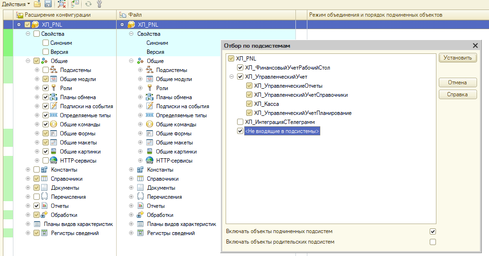
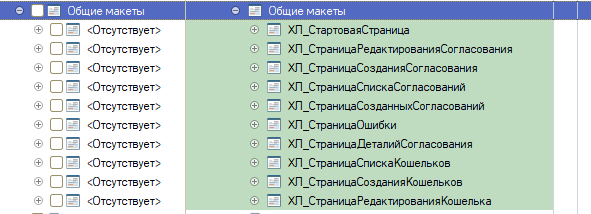
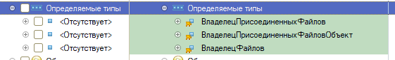
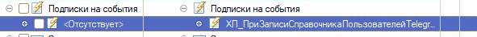
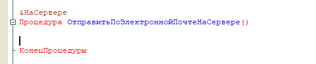
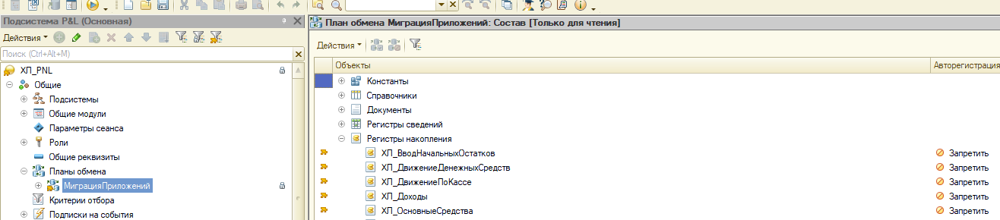

## Сравнение/объединение.

1. Отмечаем по подсистемам файла. Выбираем все кроме Телеграмм и Подсистема учета

   {width=1023px height=537px}

2. Убираем галочки:

   1. Документ ХЛ_Бюджет

   2. Документ ХЛ_МесячныйБюджет

   3. Документ ХЛ_ОтчетБаланс

   4. Общие команды ХЛ_КраснаяКнопка

   5. Общий модуль ХЛ_ВПФ_Word_ГенераторПФ

   6. Модуль приложения расширения

3. Убираем галки со всех макет, начинаются с “ХЛ_Страница….”

   {width=591px height=214px}

4. Убираем галочки со следующих определяемых типов:

   {width=561px height=86px}

5. Убираем галочки с планы обменов

   {width=438px height=43px}

6. Убираем галочку c подписки на события:

   {width=591px height=46px}

## Удаление кода

1. Общий модуль **ХЛ_КодДляОтчетовДДСиБДР**, необходимо удалить пароль.

2. Общий модуль **ХЛ_ОбщийМодульБДР**, необходимо удалить пароль.

3. Общий модуль **ХЛ_ОбщийМодульБухДокументы**, необходимо удалить пароль.

4. Общий модуль **ХЛ_СистемаУчета**, необходимо удалить пароль.

5. **Модуль отчета ХЛ_ОтчетБюджетДоходовИРасходов**, необходимо удалить пароль.

6. **Модуль отчета ХЛ_ОтчетДвижениеДенежныхСредств**, необходимо удалить пароль.

7. **Модуль отчета ХЛ_ОтчетПлатежныйКалендарь**, необходимо удалить пароль.

8. **Модуль отчета ХЛ_Взаиморасчеты**, необходимо удалить пароль.

9. Обработка 	**ХЛ_ФормированиеАктовСчетов,** очистить процедуру ОтправитьПоЭлектроннойПочтеНаСервере().

   {width=526px height=108px}

10. Документ **ХЛ_ОтчетБаланс**, удалить все процедуры на форме элемента.

11. Общая форма **ХЛ_ФормаНастройки**:

    1. очистить  процедуру ЗарегистрироватьВебХукНаСервере()

    2. удалить все упоминания BI

12. В модуле **ХЛ_СинхронизацияСZenmoney** вычистить методы ОбновитьТокенДоступа() и ПолучитьОбновленныеДанные()

### Подготовка P&L Консалтинг

1. За основу берется конфигурация P&L Консалтинг с фреша

2. При сравнении / объединении с актуальной конфигурацией

   1. Не помечать элементы подсистемы ХЛ_ПодсистемаУчета

   2. Не помечать Модуль приложения

   3. Не помечать ХЛ_РаботаСBIСистемой

3. Во всех модулях заменить использование модуля ХЛ_СистемаУчета на ХЛ_СистемаУчетаФреш (просто найти глобальным поиском)

4. На форме настроек удалить все упоминания  вкладки «Обновление»

5. На форме настроек удалить все упоминания BI системы

6. Через глобальный поиск удалить все упоминания константы ХЛ_BI_ИспользоватьBIСистему

7. Игнорировать все, что написано в **Удаление системы лицензирования**

### Удаление системы лицензирования

1. **Модуль приложения,** необходимо вычистить все места с упоминанием системы лицензирования

   1. Удалить метод «ХЛ_ПроверитьОбновленияМодуля»

   2. В методе «ХЛ_ПриНачалеРаботыСистемы»

      1. Удалить первое условие (ХЛ_ОбновлениеМодуляPNL)

      2. Удалить все, что между комментарием «// Система лицензирования»

2. Общий модуль **ХЛ_СистемаУчета**.

   1. Все процедуры удалить кроме ЛицензияПолучена(), ДанныеЛицензииДляВывода() и УстановитьВидимостьОбъектовПоВерсии().

   2. Процедуру ЛицензияПолучена() оставить в таком виде:

   [image:./ustanovka-p-l-na-fresh.png:::0,0,100,100:1075px::1459px:133px:center]

   1. В процедуре ДанныеЛицензииДляВывода() прописать версию продукта:

   [image:./ustanovka-p-l-na-fresh-2.png:::0,0,100,100:1022px::1161px:149px:center]

   1. В процедуре УстановитьВидимостьОбъектовПоВерсии() убрать заполнение разделов СтраницаЛицензирование, СтраницаОбновление и СтраницаРаботаСBI.

3. Общий модуль **ХЛ_КодДляОтчетовДДСиБДР.**

   1. В методе ОпределитьОткрытиеФормы() написать «Возврат Истина;»

   2. Очистить метод ПроверитьВерсиюЛицензииПродукта()

   3. Очистить метод ПроверитьБазовуюВерсиюЛицензииПродукта()

   4. В методе ПроверитьВерсиюБазовую() написать «Возврат Ложь;»

4. Общая форма **ХЛ_ФормаНастройки**

   1. Очистить метод УстановитьДанныеТекущейЛицензии()

Удаление общих команд (для КОРП версии не удаляем)

-  Удалить команду  «ХЛ_ОткрытьФормуСогласования»

-  Удалить команду «ХЛ_ОткрытьБаланс»

-  Удалить команду «ХЛ_ОткрытьФонды»

-  Удалить команду «ХЛ_ОткрытьВзаиморасчеты»

## **Права**

Нельзя добавлять права на интерактивное удаление (в том числе интерактивное удаление помеченных) добавленных объектов.

Для УНФ в роли «ХЛ_УправлениеФинансамиСделки» по всем объектам обязательно проверить, чтобы была снята галочка с прав на «Удаление», «Интерактивное удаление» и «Интерактивное удаление помеченных».

Для БП КОРП проверить, чтобы были выданы права на общие команды «ХЛ_ОткрытьФормуСогласования», «ХЛ_ОткрытьВзаиморасчеты», «ХЛ_ОткрытьФонды», «ХЛ_ОткрытьБаланс».

## Плохие моменты

1. Запрещено использование «ОбменДанными.Загрузка = Истина». такое нужно везде удалять

2. Во всех документах стандартных должны быть все реквизиты, которые используются в модуле. Иначе фатал

3. Планы обмена **МиграцияПриложений**. Необходимо добавить все наши реквизиты **ХЛ\_** и указать **ЗАПРЕТИТЬ**

   {width=1316px height=290px}

4. Все действия в процедурах-обработчиков событий ПередЗаписью, ПриЗаписи, ПередУдалением должны выполняться после проверки на ОбменДанными.Загрузка