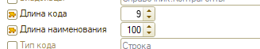
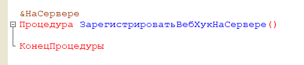

## Сравнение/объединение.

1. Отмечаем по подсистемам файла. Выбираем все кроме телеграмм

   {width=1023px height=537px}

2. Убираем галочки:

   1. Обработка ХЛ\_Баланс

   2. Документ ХЛ\_Бюджет

   3. Документ ХЛ\_МесячныйБюджет

   4. Документ ХЛ\_ОтчетБаланс

   5. Общие команды ХЛ\_КраснаяКнопка

   6. Общий модуль ХЛ\_ВПФ\_Word\_ГенераторПФ

   7. План обмена Миграции данных

   8. Модуль приложения расширения

3. Убираем галки со всех макет, начинаются с “ХЛ\_Страница….”

   {width=591px height=214px}

4. Убираем все галочки с определяемых типов, кроме «ВладелецДополнительныхСведений»

   {width=561px height=86px}

5. Убираем галочки с планы обменов

   {width=438px height=43px}

6. Убираем галочку подписки на события

   {width=591px height=46px}

7. Для БП в справочнике **Договоры** в свойствах устанавливаем пазл на длину кода и длину наименования

   {width=328px height=62px}

## Удаление кода

1. Общий модуль **ХЛ\_КодДляОтчетовДДСиБДР**, необходимо удалить пароль.

2. Общий модуль **ХЛ\_ОбщийМодульБДР**, необходимо удалить пароль.

3. Общий модуль **ХЛ\_ОбщийМодульБухДокументы**, необходимо удалить пароль.

4. **Модуль отчета ХЛ\_ОтчетБюджетДоходовИРасходов**, необходимо удалить пароль.

5. **Модуль отчета ХЛ\_ОтчетДвижениеДенежныхСредств**, необходимо удалить пароль.

6. **Модуль отчета ХЛ\_ОтчетПлатежныйКалендарь**, необходимо удалить пароль.

7. **Модуль отчета ХЛ\_Взаиморасчеты**, необходимо удалить пароль.

8. Обработка 	**ХЛ\_ФормированиеАктовСчетов,** очистить процедуру ОтправитьПоЭлектроннойПочтеНаСервере().

   {width=526px height=108px}

9. Документ **ХЛ\_ОтчетБаланс**, удалить все процедуры на форме элемента.

10. Общая форма **ХЛ\_ФормаНастройки**, очистить  процедуру ЗарегистрироватьВебХукНаСервере().

{width=504px height=108px}

1. В модуле **ХЛ\_СинхронизацияСZenmoney** вычистить методы ОбновитьТокенДоступа() и ПолучитьОбновленныеДанные()

2. Общая форма **ХЛ\_ФормаНастройки**. Удалить команду ПодключениеZenmoney

### Удаление системы лицензирования

1. **Модуль приложения,** необходимо вычистить все места с упоминанием системы лицензирования

   1. Удалить метод «ХЛ\_ПроверитьОбновленияМодуля»

   2. В методе «ХЛ\_ПриНачалеРаботыСистемы»

      1. Удалить первое условие (ХЛ\_ОбновлениеМодуляPNL)

      2. Удалить все, что между комментарием «// Система лицензирования»

2. Общий модуль **ХЛ\_КодДляОтчетовДДСиБДР.**

   1. В методе ОпределитьОткрытиеФормы написать Возврат Истина

   2. Очистить метод ПроверитьВерсиюЛицензииПродукта()

3. Общая форма **ХЛ\_ФормаНастройки**

   1. Очистить метод УстановитьДанныеТекущейЛицензии()

   2. Метод «ПриЗаполненииСпискаРазделов» удалить заполнение разделов СтраницаЛицензирование и СтраницаОбновление

   3. На форме удалить страницы СтраницаЛицензирование и СтраницаОбновление

4. Общая команда **ХЛ\_ОткрытьРабочийСтолУправлениеФин**

   1. Удалить все, что между комментарием «// Система лицензирования»

5. Константа **ХЛ\_ИспользованиеФондов**

   1. Очистить модуль менеджера значения

6. Обработка **ХЛ\_РабочийСтолПнЛ.** ФормаРабочийСтол

   1. ПриСозданииНаСервере. Удалить все, до строк «Данные конфигурации»

7. Обработка **ХЛ\_РабочийСтолПнЛ.** ФормаПлатежныйКалендарь

   1. ПриСозданииНаСервере. Удалить все, до строк «Данные конфигурации»

Удаление команд (для КОРП версии не удаляем)

-  Удалить команду «Баланс»

-  Удалить команду «Фонды»

-  Удалить команду «Взаиморасчеты»

## Плохие моменты

1. Запрещено использование «ОбменДанными.Загрузка = Истина». такое нужно везде удалять

2. Во всех документах стандартных должны быть все реквизиты, которые используются в модуле. Иначе фатал

3. Планы обмена **МиграцияПриложений**. Необходимо добавить все наши реквизиты **ХЛ\_** и указать **ЗАПРЕТИТЬ**

   {width=1316px height=290px}

4. Все действия в процедурах-обработчиков событий ПередЗаписью, ПриЗаписи, ПередУдалением должны выполняться после проверки на ОбменДанными.Загрузка

5. Не рекомендуется добавлять права на интерактивное удаление (в том числе интерактивное удаление помеченных) добавленных объектов.