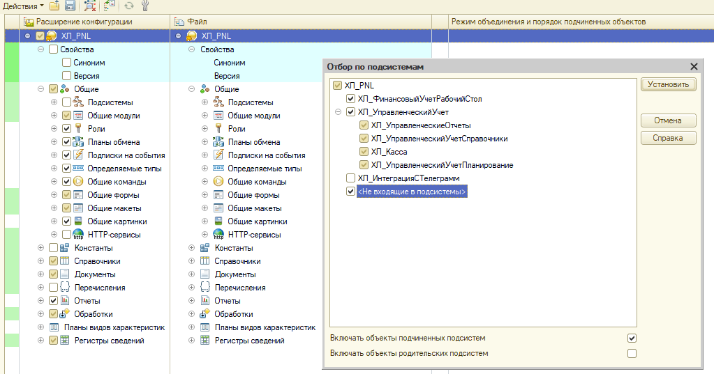
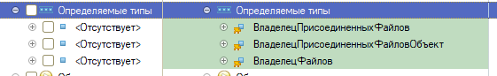
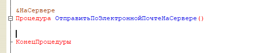
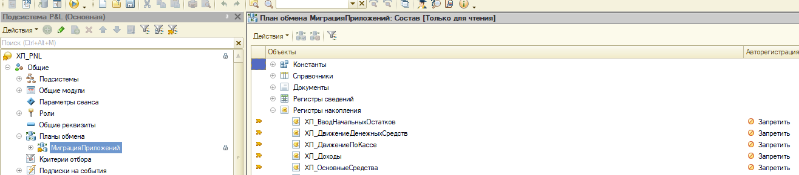

## Сравнение/объединение.

-  Отмечаем по подсистемам файла. Выбираем все кроме Телеграмм и Подсистема учета

   {width=1023px height=537px}

   1\. Убираем галочки

-  Модуль приложения расширения

-  Общий модуль ХЛ_ВПФ_Word_ГенераторПФ

-  Общий модуль ХЛ_СинхронизацияСZenmoney

-  Общая команда ХЛ_КраснаяКнопка

-  Документ ХЛ_Бюджет

-  Документ ХЛ_МесячныйБюджет

-  Документ ХЛ_ОтчетБаланс

   \
   2\. Убираем галочки со следующих определяемых типов:

{width=561px height=86px}

3\. Убираем галочки с плана обмена «МиграцияПриложений»

## Удаление кода

1. Общий модуль **ХЛ_СистемаУчета**, необходимо удалить пароль.

2. Обработка 	**ХЛ_ФормированиеАктовСчетов,** очистить процедуру ОтправитьПоЭлектроннойПочтеНаСервере().

   {width=526px height=108px}

3. В документе **ХЛ_Бюджет**, в общей форме очистить процедуру КомандаДляВнешнейОбработки()

4. В документе **ХЛ_МесячныйБюджет**, в общей форме очистить процедуру КомандаДляВнешнейОбработки()

5. Удалить все упоминания BI на формах:

   -  общая форма **ХЛ_ФормаНастройки**

   -  форма ФормаОтчетаСВерсии3015732 отчета **ХЛ_ОтчетБюджетДоходовИРасходов**

   -  форма ФормаОтчетаСВерсии3015732 отчета **ХЛ_ОтчетДвижениеДенежныхСредств**

   -  форма обработки **ХЛ_Баланс**

   -  форма обработки **ХЛ_СделкиПоДоговорам**

6. В общей форме **ХЛ_ФормаНастройки** очистить  процедуру ЗарегистрироватьВебХукНаСервере()

7. Удаление общих команд (для КОРП версии и Консалтинга не удаляем)

   -  Удалить команду  «ХЛ_ОткрытьФормуСогласования»

   -  Удалить команду «ХЛ_ОткрытьБаланс»

   -  Удалить команду «ХЛ_ОткрытьФонды»

   -  Удалить команду «ХЛ_ОткрытьВзаиморасчеты»

   

### Подготовка P&L Консалтинг

1. Не обновлять модуль приложения (правки вносить вручную)

2. Модуль ХЛ_СистемаУчета (по сути, можно просто его не объединять)

   1. Снять пароль с модуля ХЛ_СистемаУчета

   2. Удалить функции:

      1. ОбновленияДоступны

      2. ПолучитьСписокВерсий

      3. ПолучитьСсылкуНаДокументацию

      4. ПолучитьОписаниеПоСсылке

      5. ПолучитьФайлОбновления

      6. ПолучитьФайлОбновленияПоПолномуПути

      7. ЕстьНовыеВерсии

      8. ПолучитьНавигационнуюСсылкуОбновления

   3. Из УстановитьВидимостьОбъектовПоВерсии в ветке `ИначеЕсли Форма.ИмяФормы = "ОбщаяФорма.ХЛ_ФормаНастройки" Тогда` удалить добавление страниц «Обновление» и BI

3. Форма ХЛ_РабочийСтол.ФормаПоддержка:

   1. Удалить код поиска версии расширения и поиска обновлений

   2. Из HTML удалить блок обновлений и текущей версии

### В иных случаях: Удаление системы лицензирования

1. **Модуль приложения,** необходимо вычистить все места с упоминанием системы лицензирования

   1. Удалить метод «**ХЛ_ПроверитьОбновленияМодуля**»

   2. В методе «**ХЛ_ПриНачалеРаботыСистемы**»

      1. Удалить первое условие (ХЛ_ОбновлениеМодуляPNL)

      2. Удалить все, что между комментарием «// Система лицензирования»

2. Общий модуль **ХЛ_СистемаУчета**.

   1. Все процедуры удалить кроме ЛицензияПолучена(), ДанныеЛицензииДляВывода(), УстановитьВидимостьОбъектовПоВерсии() и ПроверитьКонстантыЛицензий().

   2. Процедуру ЛицензияПолучена() оставить в таком виде:

   [image:./ustanovka-p-l-na-fresh.png:::0,0,100,100:1075px::1459px:133px:center]

   1. В процедуре ДанныеЛицензииДляВывода() прописать версию продукта:

   [image:./ustanovka-p-l-na-fresh-2.png:::0,0,100,100:1022px::1161px:149px:center]

   1. В процедуре УстановитьВидимостьОбъектовПоВерсии() убрать заполнение разделов СтраницаЛицензирование, СтраницаОбновление и СтраницаРаботаСBI.

3. Общий модуль **ХЛ_КодДляОтчетовДДСиБДР.**

   1. В методе ОпределитьОткрытиеФормы() написать «Возврат Истина;»

   2. Очистить метод ПроверитьВерсиюЛицензииПродукта()

   3. Очистить метод ПроверитьБазовуюВерсиюЛицензииПродукта()

   4. В методе ПроверитьВерсиюБазовую() написать «Возврат Ложь;»

4. Форма ХЛ_РабочийСтол.ФормаПоддержка:

   1. Удалить код поиска версии расширения и поиска обновлений

   2. Из HTML удалить блок обновлений и текущей версии

5. Общая форма **ХЛ_ФормаНастройки**

   1. Очистить метод УстановитьДанныеТекущейЛицензии()

## **Права**

Нельзя добавлять права на интерактивное удаление (в том числе интерактивное удаление помеченных) добавленных объектов.

Для УНФ в роли «ХЛ_УправлениеФинансамиСделки» по всем объектам обязательно проверить, чтобы была снята галочка с прав на «Удаление», «Интерактивное удаление» и «Интерактивное удаление помеченных».

Для БП КОРП проверить, чтобы были выданы права на общие команды «ХЛ_ОткрытьФормуСогласования», «ХЛ_ОткрытьВзаиморасчеты», «ХЛ_ОткрытьФонды», «ХЛ_ОткрытьБаланс».

## Плохие моменты

1. Запрещено использование «ОбменДанными.Загрузка = Истина». такое нужно везде удалять

2. Во всех документах стандартных должны быть все реквизиты, которые используются в модуле. Иначе фатал

3. Планы обмена **МиграцияПриложений**. Необходимо добавить все наши реквизиты **ХЛ\_** и указать **ЗАПРЕТИТЬ**

   {width=1316px height=290px}

4. Все действия в процедурах-обработчиков событий ПередЗаписью, ПриЗаписи, ПередУдалением должны выполняться после проверки на ОбменДанными.Загрузка