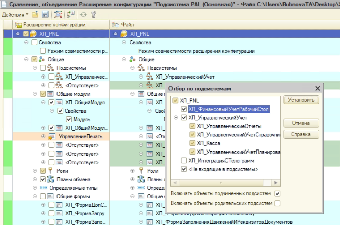
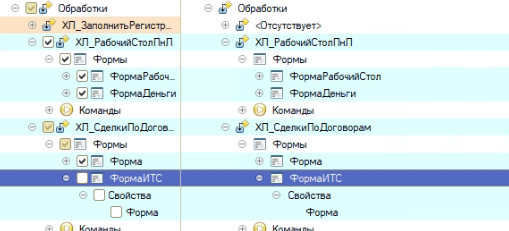

Делаем через сравнение и объединение

1. Отметить по подсистемам файла. Отметить все, кроме ХЛ\_ИнтеграцияСТелеграм

   {width=674px height=447px}

   

2. Убираем режим совместимости

3. Убираем галочки со справочников:

   1. Бановские счета

   2. ДоговорыКонтрагентов

   3. Контрагенты

   4. Номенклатура

   5. СтатьиДвиженияДенежныхСредств

   6. 	ХЛ\_ВидыПрикрепленныхФайлов	

   7. 	удалитьХЛ\_ПортфелиПроектов

   8. 	ХЛ\_ШаблоныДоговора	ХЛ\_ШаблоныДоговора

      

      								

   9. 														 

4. **Перечисления**

   Убрать все галочки

   Установить все галки, где есть ХЛ\_

   убрать только галочку, где 	**ХЛ\_ВидыОплат**

   

   							

5. **Обработки**

   Убирать галочку формы ИТС

   {width=509px height=231px}

