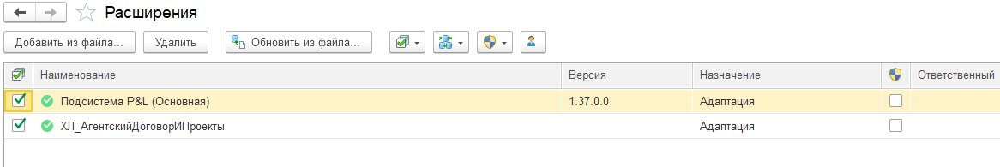
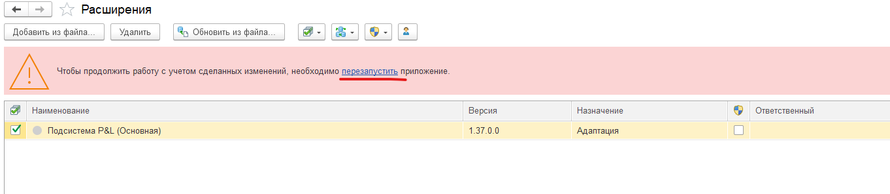

###### Инструкция по обновлению P&L

**Шаг 1: Подготовка**

1. Откройте клиент 1С:

   -  Запустите ярлык «1С:Предприятие».

   -  Выберите нужную информационную базу.

   -  В поле «Режим запуска» выберите **«Предприятие»** (не «Конфигуратор»).

2. Войдите в систему под пользователем с правами **администратора**.

3. Перейдите в раздел  **«Администрирование» -> «Обслуживание» -> «Активные пользователи»** и убедитесь, что **ВСЕ пользователи вышли из базы**.

   {width=1723px height=285px}

### Шаг 2: Обновление расширения

1. Перейдите в раздел  **«Администрирование» -> «Печатные формы, отчеты и обработки» -> «Расширения».**

2. Перед вами откроется список всех расширений базы. В нём найдите «**Подсистема P&L (Основная)**».

   {width=1166px height=195px}

3. Кликните левой кнопкой мыши один раз по наименованию расширения.

4. Чуть выше нажмите кнопку «**Обновить из файла…**», выскочит предупреждение безопасности - нажмите «**Продолжить**». Перед вами откроется окно выбора файла обновления - нам необходимо перейти по тому пути, где у вас лежит файл с расширением **.cfe** и выбрать его, после чего нажать кнопку «**Открыть**».

5. 1С начнёт процесс обновления расширения, после чего необходимо будет перезапустить программу.

   {width=1362px height=299px}

6. После перезапуска перейдите в 1С:P&L и сформируйте отчёт **ДДС**. Если всё сформировалось успешно, то **РАСШИРЕНИЕ ОБНОВЛЕНО**.