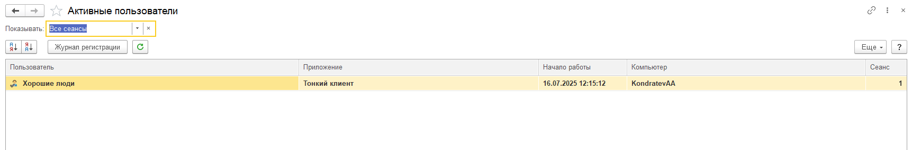
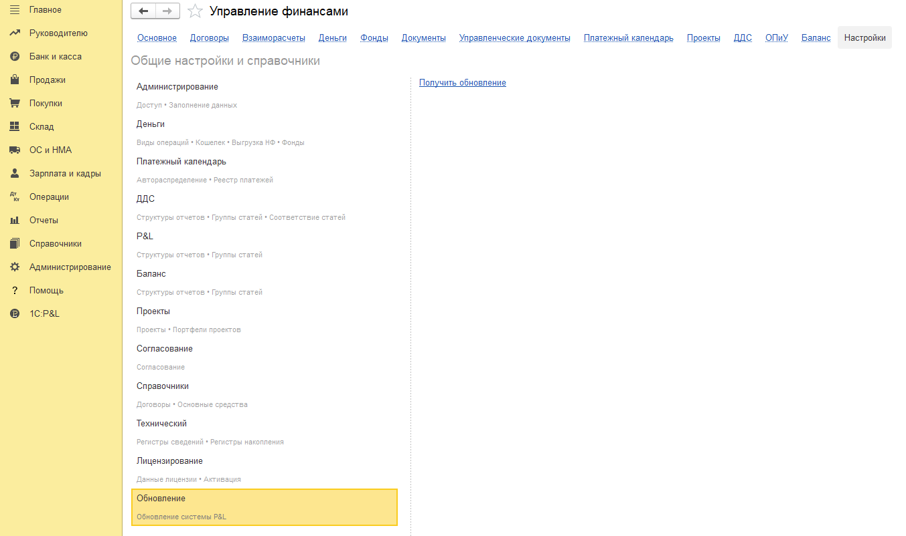
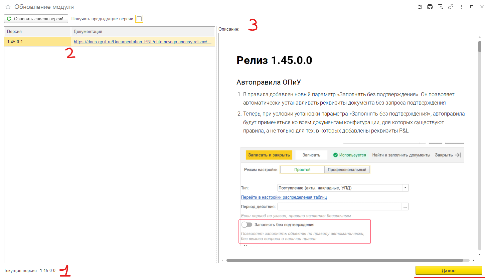
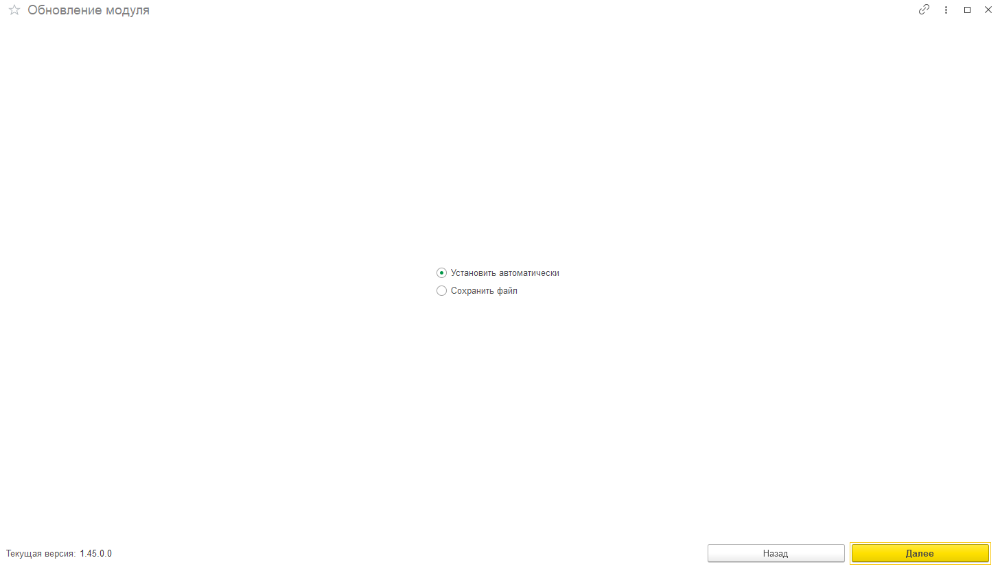
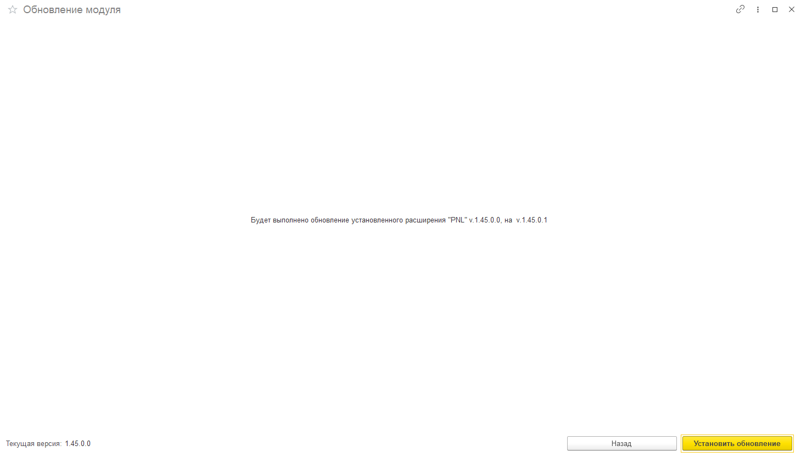
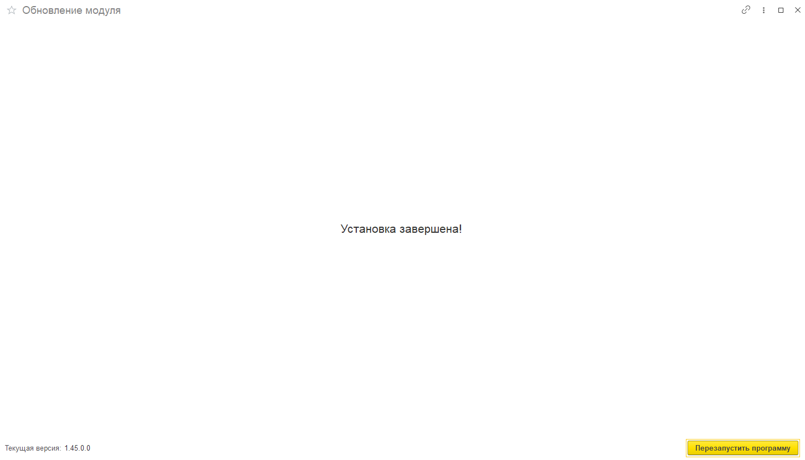

###### Инструкция по обновлению P&L

### **Шаг 1: Подготовка**

1. Откройте клиент 1С:

   -  Запустите ярлык «1С:Предприятие».

   -  Выберите нужную информационную базу.

   -  В поле «Режим запуска» выберите **«Предприятие»** (не «Конфигуратор»).

2. Войдите в систему под пользователем с правами **администратора**.

3. Перейдите в раздел  **«Администрирование» -> «Обслуживание» -> «Активные пользователи»** и убедитесь, что **ВСЕ пользователи вышли из базы**.

   {width=1723px height=285px}

### Шаг 2: Обновление расширения

1. Перейдите в сам модуль **P&L** на главной панели разделов, затем в «**Настройки**» -> «**Обновление**».

   Нажмите на кнопку «**Получить обновление**»

   {width=1353px height=802px}

2. В открывшемся окне вы можете увидеть **номер текущей версии (1)**, **список новых версий** **(2)**, **описание изменений** в новой версии **(3).** Для продолжения нажмите кнопку «**Далее**».

   {width=1458px height=838px}

3. В следующем окне выберите вариант установки - «**Установить автоматически**» или «**Сохранить в файл**». Рекомендуем выбирать автоматический вариант. Нажмите кнопку «**Далее**».

   {width=1457px height=832px}

4. В следующем окне модуль предупредит вас об обновлении на новую версию, нажмите на кнопку «**Установить обновление**».

   {width=1459px height=834px}

5. После обновление модуль сообщит, что установка успешно завершена. Перезапустите программу нажав на соответствующую кнопку.

   {width=1453px height=832px}

6. **Обновление завершено!**