Как поступит задача на установку, первым делом обратите внимание на следующие вещи - какая **конфигурация** указана в задаче (БП, УНФ, КА, УТ), **ИНН** клиента и есть ли период (до какого числа установить). Если есть период, то это **демо-версия или подписка,** если нет, то это **полная версия без периода ограничения**.

## Рассмотрим **подготовку расширения для болванки:**

1. Откройте базу в режиме конфигуратора необходимой конфигурации и подключитесь к хранилищу конфигурации, введя путь и логин:

   **Хранилище БП** *\- \\\\192.168.100.4\\внутренняя деятельность\\ХРАНИЛИЩЕ\\150 - ТИРАЖНЫЕ РЕШЕНИЯ\\40 - P&L для БП\\001 - Основное хранилище*

   **Хранилище УНФ** - *\\\\192.168.100.4\\внутренняя деятельность\\ХРАНИЛИЩЕ\\150 - ТИРАЖНЫЕ РЕШЕНИЯ\\50 - P&L для УНФ\\01- Основное хранилище*

   **Хранилище УТ** - *\\\\192.168.100.4\\внутренняя деятельность\\ХРАНИЛИЩЕ\\150 - ТИРАЖНЫЕ РЕШЕНИЯ\\100 - P&L для УТ\\Основное хранилище*

   **Хранилище КА** - *\\\\192.168.100.4\\внутренняя деятельность\\ХРАНИЛИЩЕ\\150 - ТИРАЖНЫЕ РЕШЕНИЯ\\120 - P&L для КА*

   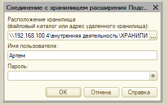{width=329px height=206px}

2. Откройте расширения конфигурации, затем откройте P&L, нажмите правой кнопкой мыши по названия расширения, а затем на кнопку «**Получить из хранилища**».

   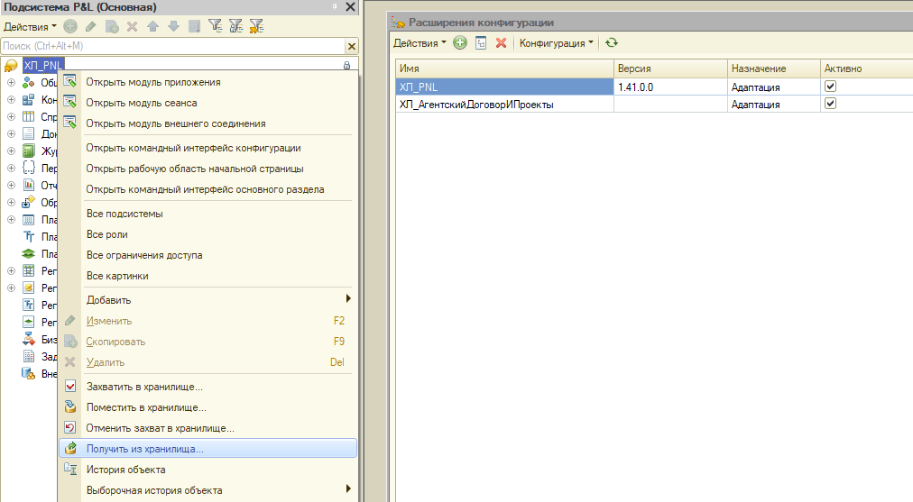{width=1012px height=557px}

3. В следующем окне обязательно поставьте галочку «**Выполнять рекурсивно**» и нажмите «ОК». Рекомендую повторить данную операцию несколько раз, на случай, если доработок слишком много.

   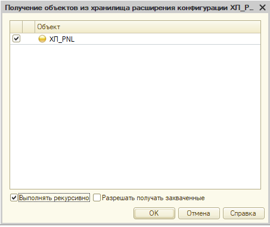{width=453px height=381px}

4. Далее в служебных сообщениях, вы увидите, конкретные изменения из хранилища.

   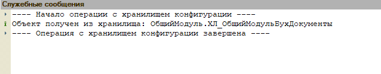{width=638px height=125px}

5. Затем обновите конфигурацию базы данных, нажав на синюю кнопочку.

   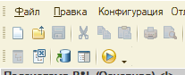{width=207px height=84px}

6. В «Расширениях конфигурации» нажмите на название расширения правой кнопкой мыши -> Конфигурация -> Сохранить конфигурацию в файл.

   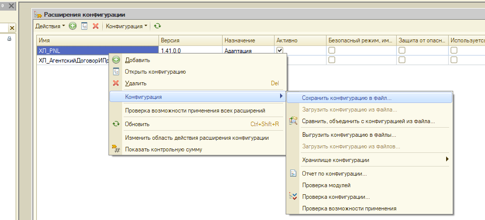{width=961px height=436px}

Поздравляю, вы подготовили все новые изменения к загрузке в болванку. Что делаем дальше?

#### Далее идите на сервер **192\.168.100.8 и ВЫПОЛНЯЙТЕ ВСЕ ПОСЛЕДУЮЩИЕ ДЕЙСТВИЯ НА НЁМ !**

Рекомендую создать на рабочем столе отдельную папку «название расширения\_номер версии», например «**PNL_1.41**» и перекиньте только что созданный файлик сюда. В ней создайте ещё папку «**Шифрованные расширения**».

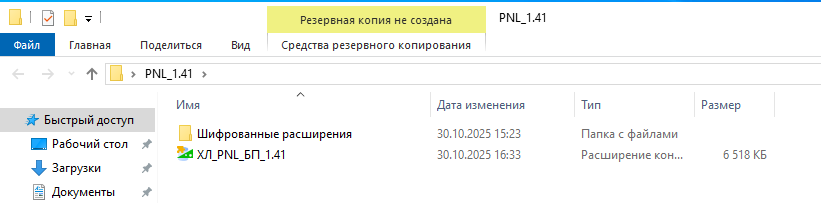{width=821px height=203px}

Если у вас нет учётки, обратитесь к Скосыреву Д.

На данном сервере в самой 1Ске, вам необходимо добавить 4 базы в файловом варианте к себе в список:

-  *File="D:\\Базы1С\\Кондратьев Артем\\БП PNL";*

-  *File="D:\\Базы1С\\Кондратьев Артем\\КА PNL";*

-  *File="D:\\Базы1С\\Кондратьев Артем\\УНФ PNL";*

-  *File="D:\\Базы1С\\Кондратьев Артем\\УТ PNL";*

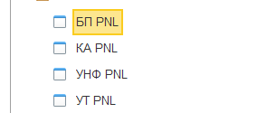{width=295px height=125px}

В данных базах нет логина и пароля, поэтому вход свободный.

## Рассмотрим **установку новой версии на болванку:**

1. Откройте в **Конфигураторе** нужную вам базу.

2. Далее **откройте расширения конфигурации** -> **правой кнопкой мыши по названию** -> **Конфигурация** -> **Загрузить конфигурацию из файла** -> **выберите файлик** из папки нового релиза.

3. Соглашаемся с загрузкой файлика, обновляем базу данных конфигурации

Поздравляю, вы **загрузили новую версию** в болванку!

## Рассмотрим **подготовку подписки или демо**:

1. Откройте в **Конфигураторе** нужную вам базу. Далее **откройте расширения конфигурации** и нажмите два раза по названию расширения. Вам откроется «**Подсистема P&L (Основная)**».

   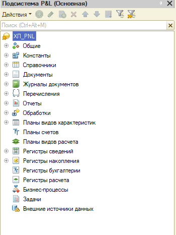{width=350px height=466px}

2. Провалитесь в **Общие -> Общие модули -> ХЛ\_КодДляОтчетовДДСиБДР -> правой кнопкой мыши -> Открыть модуль.**

   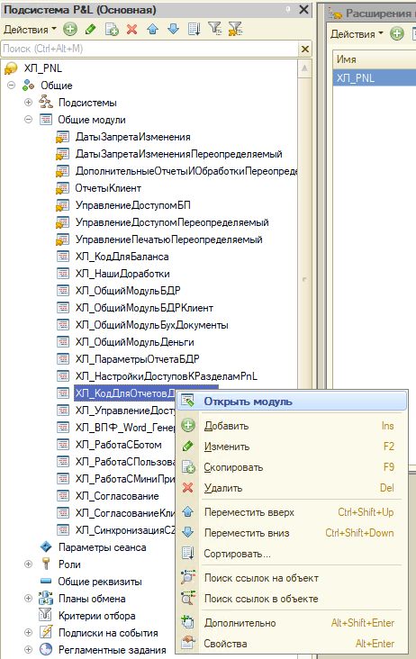{width=462px height=732px}

3. Введите наш секретный пароль) и нажмите **ОК**

   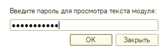{width=273px height=86px}

4. Далее в коде пролистайте в самый низ и раскройте функцию **ПроверитьНаСовместимость ()**

   В данном модуле вы найдёте комментарии **\- - Клиенты**, **\- - Подписки**, **\- - Демо**

5. Чтобы добавить нового клиента в **Демо** или **Подписки** вам необходим его **ИНН** и знание срока окончания подписки. Пример:

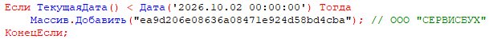{width=614px height=54px}

Это **подписка** на P&L, так как срок указывается на год или шесть месяцев. Если вам нужно создать нового клиента, то просто скопируйте данные строчки, измените дату (год - месяц - день) и измените данную хэш-функцию из символов.

Стоп.

А где её взять, то?

А всё просто, **ИНН клиента нам необходимо преобразовать в MD5 хэш.** [**https://md5-online.ru/**](https://md5-online.ru/)

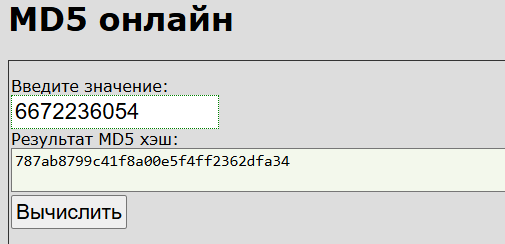{width=505px height=244px}

Вводите **ИНН** и нажимайте на кнопочку **Вычислить**. Теперь у вас есть хэш-функция нового клиента.

## С **ДЕМО** всё то же самое, но просто срок обычно ставится - одна неделя.

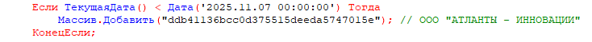{width=734px height=53px}

## А как быть с бессрочной лицензией?

Вам необходимо найти блок **\- - Клиенты**, так же создать хэш-функцию, но не указывать срок.

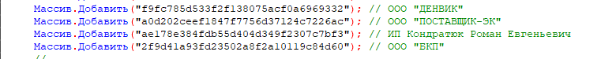{width=761px height=75px}

## Заключительный этап

1. После того, как вы вписали нового клиента, выгрузите данное расширение к себе в папку с новым релизом.

2. В подсистеме P&L откройте **Отчеты ->** вам понадобится зашифровать 3 отчёта (ХЛ\_ОтчетБюджетДоходовИРасходов; ХЛ\_ОтчетДвижениеДенежныхСредств; ХЛ\_ОтчетПлатежныйКалендарь). 

3. Для этого **откройте модуль объекта**, введите наш **секретный пароль** и далее откройте данный сайт - <https://netlenka.org/> (логин - [birukovfa@gp-it.ru](mailto:birukovfa@gp-it.ru), пароль - [birukovfa@gp-it.ru](mailto:birukovfa@gp-it.ru))

   Нажмите на кнопку «**Приступить к защите**» -> в нашем модуле объекта Ctrl+A, Ctrl+C -> Ctrl+V в окно на сайте -> Защитить

   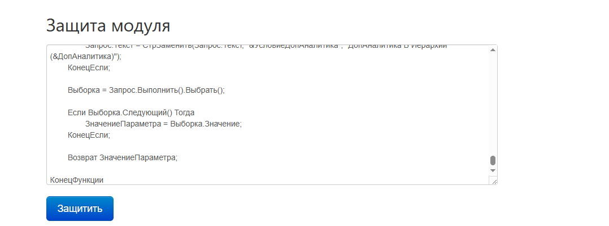{width=1078px height=402px}

4. Скопируйте весь обфусцированный код с полной заменой обычного кода в конфигурации.

5. Данные действия **ПОВТОРИТЬ** для оставшихся отчётов.

6. Таким же образом зашифруйте 2 общих модуля (ХЛ\_КодДляОтчетовДДСиБДР, ХЛ\_СистемаУчета).

7. Снова выгрузите данное расширение к себе в папку с новым релизом в отдельную папку «**Шифрованные расширения**».

Поздравляю, расширение готово для установки и обновления клиентам!